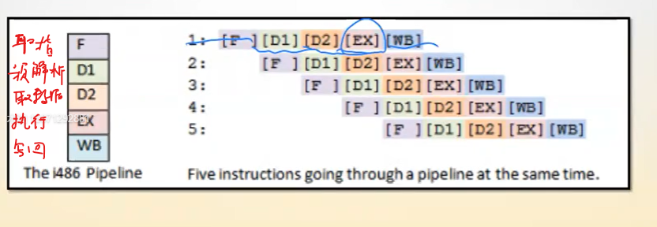
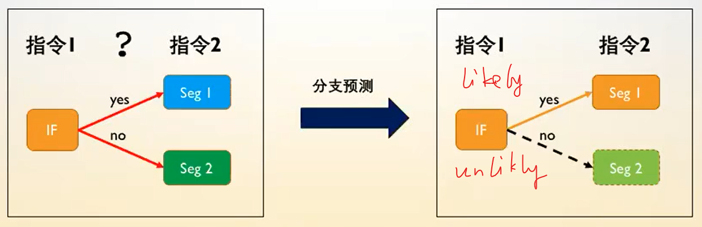
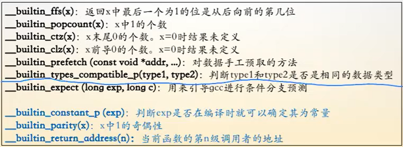
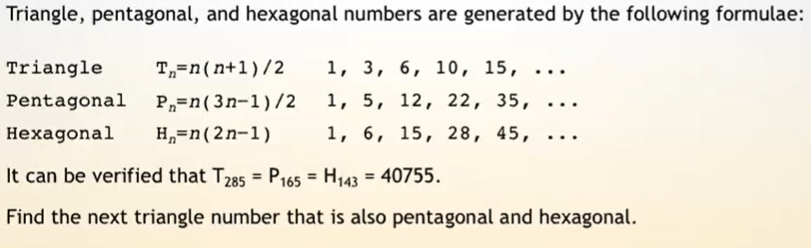

# C 语言程序设计

## 语言入门基础

- 汇编与 C 语言
	- 易用性
	- 可移植性
- 简史
	- Unix -> Linux
- 输出函数说明
	- printf 函数
		- 头文件: stdio.h
		- 原型: int printf(const char *format, ...);
			- int: 返回类型
			- printf: 函数名
			- ...: 可变参数列表
		- format: 格式控制字符串
			- %d: dec int
			- %s: string
			- %c: char
			- %lf: double
		- ...:可边参数列表
		- 返回值: 输出字符的数量
			- hello haizei\n: 13
- 输入函数说明
	- scanf 函数
		- 头文件: stdio.h
		- 原型: int scanf(const char *format, ...);
			- int: 返回类型
			- printf: 函数名
			- ...: 可变参数列表
		- format: 格式控制字符串
		- ...:可边参数列表
		- 返回值: 成功读入参数的字数
- 随堂练习题-1
	- 请使用 printf 函数，求解一个数字 n 的十进制表示的数字位数
- 随堂练习题-2
	- 请写一个程序，读入一行字符串（可能包含空格），输出这个字符串中字符的数量
- 补充
	- 格式化字符串 wiki
	- 工具书
		- C 语言核心技术
			- 第三部分 基本工具（略读）
			- 第 1 章 -- 第 8 章（快速浏览）
			- 第 9、10 章（精读）
			- 第 11 章 -- 第 15 章（快速浏览）
			- 全书重新浏览一遍（加深印象）

## 数学运算

- C 语言基本运算符
	- =
	- +, -, *, /, ()
		- int a = 3 / 2;
			- 1 (下取整)
		- double a = 3 / 2;
			- 1.000... (两个整形相除，还是向下取整，但之后被转为 double)
		- double a = 3 / 2.0
			- 1.5
	- %
	- &, |, ^, ~
		- &: 按位与，有 0 为 0，同 1 为 1
			```
			2 & 3 = 2
				1 0
				1 1
			=>	1 0
			```
		- |: 按位或（逻辑加法），有 1 为 1，同 0 为 0
			```
			2 | 3 = 3
				1 0
				1 1
			=>	1 1
			```
		- ^: 按位异或，相同为 0，不同为 1
			```
			2 ^ 3 = 1
				1 0
				1 1
			=>	0 1
			```
			- 满足交换律: a ^ b = b ^ a
			- 是可逆操作: a ^ b = c => c ^ b = a
			```
			知道其中两个的值，就能推出第三个
				a	1 0 1
				b   1 1 0
			=>	c	0 1 1
			```
		- ~: 按位取反
			```
			~3 = 0
				1 1
			=>	0 0
			```
		- 位和位做运算，每位彼此不影响
	- <<, >>
		- 左移和右移
			- 64 位操作系统表示一个整型用 4 Bytes, 32 bit
				- 最大可以表示 2 ^ 31，有一位位符号位 (0: 正数, 1: 负数)
				```
				dec:	7
				bin:	0 (28 个)0 1 1 1

				dec:	7 << 1 = 14
				bin:	0 (27 个)0 1 1 1 0

				dec:	7 >> 1 = 3 (下取整), -3 >> 1 = -2
				bin:	0 (29 个)0 1 1
				```
- C 语言中的数学函数库
	- 文件头: math.h
	- 常用函数
		- pow(a, n): 求幂次, 求 a 的 n 次方的值，返回 double
			- 要用 int 的话要强转: (int)pow(a, n)
		- sqrt(n)：求 n 的平方根，返回 double
		- ceil(n): 上取整
		- floor(n): 下取整
		- abs(n) (stdlib.h): 求绝对值，参数只能是整型
		- fabs(n): 浮点求绝对值
		- log(n)
		- log10(n)
		- acos(n): 反三角函数 arccos(x)
			- cos(pi) = -1 => acos(-1) = pi
			- 角度换弧度:
				- 弧度 = 角度 * (pi / 180)
		- ...
	- 随堂练习-1
		- 请写一个程序，输入一个数字 x，输出数字 x 的平方根
	- 随堂练习-2
		- 请写一个程序，读入一个角度值，将角度转换为弧度制
	- 资料推荐
		- 极客学院：C 语言教程 中文版
			- 29 个头文件
		- https://en.cppreference.com/w/

- inttypes 头文件讲解
	- https://en.cppreference.com/w/
		- https://en.cppreference.com/w/c/types/integer
			- int8_t: 8 bit int (2 ^ (8 - 1) 个数字)
			- int64_t: longlong
			- Format macro constants
				- PRID
					- 5.cpp
- 数学运算代码演示
	- 左值 VS 右值
	- 运算符的优先级
		- 优先级
		- 方向
			- 左结合
			- 右结合
	- 位运算
		- 按位与 &
			- 判断奇偶
		- 异或
			- 交换值
	- 6.cpp
- 程序入门习题答疑

## 关系运算

### 分支结构讲解
- 关系运算符
	- ==, != <, >, <=, =>, !
	- 返回 0(false) 或 1(true)
	- !!(x) 归一化
		- !!(5) -> 1
		- !!(-1) -> 1
- IF 语句

	```cpp
	if (表达式 1) {

	} else if (表达式 2) {

	} else {

	}
	```
	
	- 随堂练习题-1
		- 程序读入一个正整数 n，代表学生的成绩，根据分数输出分档位
			- n = 0, FOOLISH
			- 0 < n < 60, FALL
			- 60 <= n < 75, MEDIUM
			- 75 <= n <= 100, GOOD

- SWITCH 语句

	```cpp
	switch (a) {
		case 1: 代码块1; break;
		case 2: 代码块2; break;
		case 3: 代码块3; break;
		default: 代码块4;
	}
	```

	- 随堂练习题-2
		- 请使用 switch 结构完成如下任务，程序读入一个整数 n:
			- 如果 n = 1: 输出 one
			- 如果 n = 2: 输出 two
			- 如果 n = 3: 输出 three
			- 否则输出 error

- CPU 的分支预测
	- 附录 1、回文整数 
		- 计算机执行 if 语句比较慢
		- LeetCode 9. Palindrome Number
			- Determin whether an integer is a palindrome. Do this without extra space.
				- 1234 -> false
				- 12321 -> true
		- 内核指令: _builtin _expect()
			
			```cpp
			#define likely(x) _builtin_expect(!!(x), 1)
			#define unlikely(x) _builtin_expect(!!(x), 0)

			// likely 代表 x 经常成立
			// unlikely 代表 x 不经常成立
			```

			

			- 一条指令用一个执行周期 (但起始不均匀)
			- 串行执行方式，全流程只有一个在执行 5 * 5 = 25
			- 并行执行方式, 流水线 5 + 4 = 9
			- cpu 一般时并行执行，当 cpu 遇到 if 时，要等待结果，会做一个预判断，但当判断错的时候，要重新计算，变成了串行执行
			- 可以人为的用内核指令帮助预判断

				

				- 大概率成立 

		- 其他常用内核指令

			
- WHILE 语句
	- 随堂练习-4
		- 使用 while 循环实现程序，输出 1-100
- FOR 语句
	- 随堂练习-5
		- 使用 for 循环实现程序，输出 1-100

## 函数和递归函数

### 函数

### 递归程序

- 程序调用自身的编程技巧叫做递归
	- 有一种算法叫递推算法，和递归没有太多联系
	- 递归程序的组成部分
		- 确定语义信息
		- 边界条件处理
			- 错误的边界条件可能导致爆栈
				- 栈区
					- 调用函数时被利用
					- 8MB (200 万 int)
					- 爆栈错动：核心已转储 (Segmentation fault)
				- 堆区
					- 内存大小
		- 针对于问题的处理过程和递归过程
			- 调用自己之后是回溯过程
		- 结果返回
- 随堂练习题-2
	- 读入 n，计算 n 的阶乘
- 函数指针

	```cpp
	// f1, f2, f3 是传进来的函数
	// 函数最重要的是返回值和参数列表，就是 int 和 (int),
	// (*f1) 是指将某一个函数当作一个变量存进来，放到一个函数变量中
	int g(int (*f1)(int), int (*f2)(int), int (*f3)(int), int x)) {
		if (x < 0) {
			return f1(x);
		}
		if (x < 100) {
			return f2(x);
		}
		return f3(x);
	}
	```

	- int *a; // a 是指向整型的一个指针变量
	- 函数指针被设计出来有什么作用?
		- 方便解决类似于分段函数的函数调用
- PE-45 函数指针的应用 (欧拉计划 45 题)

	