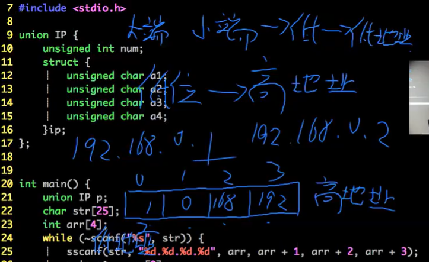

# C 语言程序设计

## 语言入门基础

- 汇编与 C 语言
	- 易用性
	- 可移植性
- 简史
	- Unix -> Linux
- 输出函数说明
	- printf 函数
		- 头文件: stdio.h
		- 原型: int printf(const char *format, ...);
			- int: 返回类型
			- printf: 函数名
			- ...: 可变参数列表
		- format: 格式控制字符串
			- %d: dec int
			- %s: string
			- %c: char
			- %lf: double
		- ...:可边参数列表
		- 返回值: 输出字符的数量
			- hello haizei\n: 13
- 输入函数说明
	- scanf 函数
		- 头文件: stdio.h
		- 原型: int scanf(const char *format, ...);
			- int: 返回类型
			- printf: 函数名
			- ...: 可变参数列表
		- format: 格式控制字符串
		- ...:可边参数列表
		- 返回值: 成功读入参数的字数
- 随堂练习题-1
	- 请使用 printf 函数，求解一个数字 n 的十进制表示的数字位数
- 随堂练习题-2
	- 请写一个程序，读入一行字符串（可能包含空格），输出这个字符串中字符的数量
- 补充
	- 格式化字符串 wiki
	- 工具书
		- C 语言核心技术
			- 第三部分 基本工具（略读）
			- 第 1 章 -- 第 8 章（快速浏览）
			- 第 9、10 章（精读）
			- 第 11 章 -- 第 15 章（快速浏览）
			- 全书重新浏览一遍（加深印象）

## 数学运算

- C 语言基本运算符
	- =
	- +, -, *, /, ()
		- int a = 3 / 2;
			- 1 (下取整)
		- double a = 3 / 2;
			- 1.000... (两个整形相除，还是向下取整，但之后被转为 double)
		- double a = 3 / 2.0
			- 1.5
	- %
	- &, |, ^, ~
		- &: 按位与，有 0 为 0，同 1 为 1
			```
			2 & 3 = 2
				1 0
				1 1
			=>	1 0
			```
		- |: 按位或（逻辑加法），有 1 为 1，同 0 为 0
			```
			2 | 3 = 3
				1 0
				1 1
			=>	1 1
			```
		- ^: 按位异或，相同为 0，不同为 1
			```
			2 ^ 3 = 1
				1 0
				1 1
			=>	0 1
			```
			- 满足交换律: a ^ b = b ^ a
			- 是可逆操作: a ^ b = c => c ^ b = a
			```
			知道其中两个的值，就能推出第三个
				a	1 0 1
				b   1 1 0
			=>	c	0 1 1
			```
		- ~: 按位取反
			```
			~3 = 0
				1 1
			=>	0 0
			```
		- 位和位做运算，每位彼此不影响
	- <<, >>
		- 左移和右移
			- 64 位操作系统表示一个整型用 4 Bytes, 32 bit
				- 最大可以表示 2 ^ 31，有一位位符号位 (0: 正数, 1: 负数)
				```
				dec:	7
				bin:	0 (28 个)0 1 1 1

				dec:	7 << 1 = 14
				bin:	0 (27 个)0 1 1 1 0

				dec:	7 >> 1 = 3 (下取整), -3 >> 1 = -2
				bin:	0 (29 个)0 1 1
				```
- C 语言中的数学函数库
	- 文件头: math.h
	- 常用函数
		- pow(a, n): 求幂次, 求 a 的 n 次方的值，返回 double
			- 要用 int 的话要强转: (int)pow(a, n)
		- sqrt(n)：求 n 的平方根，返回 double
		- ceil(n): 上取整
		- floor(n): 下取整
		- abs(n) (stdlib.h): 求绝对值，参数只能是整型
		- fabs(n): 浮点求绝对值
		- log(n)
		- log10(n)
		- acos(n): 反三角函数 arccos(x)
			- cos(pi) = -1 => acos(-1) = pi
			- 角度换弧度:
				- 弧度 = (角度 * pi) / 180
		- ...
	- 随堂练习-1
		- 请写一个程序，输入一个数字 x，输出数字 x 的平方根
	- 随堂练习-2
		- 请写一个程序，读入一个角度值，将角度转换为弧度制
	- 资料推荐
		- 极客学院：C 语言教程 中文版
			- 29 个头文件
		- https://en.cppreference.com/w/

- inttypes 头文件讲解
	- https://en.cppreference.com/w/
		- https://en.cppreference.com/w/c/types/integer
			- int8_t: 8 bit int (2 ^ (8 - 1) 个数字)
			- int64_t: longlong
			- Format macro constants
				- PRID
					- 5.cpp
- 数学运算代码演示
	- 左值 VS 右值
	- 运算符的优先级
		- 优先级
		- 方向
			- 左结合
			- 右结合
	- 位运算
		- 按位与 &
			- 判断奇偶
		- 异或
			- 交换值
	- 6.cpp
- 程序入门习题答疑

## 关系运算

### 分支结构讲解
- 关系运算符
	- ==, != <, >, <=, =>, !
	- 返回 0(false) 或 1(true)
	- !!(x) 归一化
		- !!(5) -> 1
		- !!(-1) -> 1
- IF 语句

	```cpp
	if (表达式 1) {

	} else if (表达式 2) {

	} else {

	}
	```
	
	- 随堂练习题-1
		- 程序读入一个正整数 n，代表学生的成绩，根据分数输出分档位
			- n = 0, FOOLISH
			- 0 < n < 60, FALL
			- 60 <= n < 75, MEDIUM
			- 75 <= n <= 100, GOOD

- SWITCH 语句

	```cpp
	switch (a) {
		case 1: 代码块1; break;
		case 2: 代码块2; break;
		case 3: 代码块3; break;
		default: 代码块4;
	}
	```

	- 随堂练习题-2
		- 请使用 switch 结构完成如下任务，程序读入一个整数 n:
			- 如果 n = 1: 输出 one
			- 如果 n = 2: 输出 two
			- 如果 n = 3: 输出 three
			- 否则输出 error

- CPU 的分支预测
	- 附录 1、回文整数 
		- 计算机执行 if 语句比较慢
		- LeetCode 9. Palindrome Number
			- Determin whether an integer is a palindrome. Do this without extra space.
				- 1234 -> false
				- 12321 -> true
		- 内核指令: _builtin _expect()
			
			```cpp
			#define likely(x) _builtin_expect(!!(x), 1)
			#define unlikely(x) _builtin_expect(!!(x), 0)

			// likely 代表 x 经常成立
			// unlikely 代表 x 不经常成立
			```

			

			- 一条指令用一个执行周期 (但起始不均匀)
			- 串行执行方式，全流程只有一个在执行 5 * 5 = 25
			- 并行执行方式, 流水线 5 + 4 = 9
			- cpu 一般时并行执行，当 cpu 遇到 if 时，要等待结果，会做一个预判断，但当判断错的时候，要重新计算，变成了串行执行
			- 可以人为的用内核指令帮助预判断

				

				- 大概率成立 

		- 其他常用内核指令

			
- WHILE 语句
	- 随堂练习-4
		- 使用 while 循环实现程序，输出 1-100
- FOR 语句
	- 随堂练习-5
		- 使用 for 循环实现程序，输出 1-100

## 函数和递归函数

### 函数

- int f(int x) { return 0; }

### 递归程序

- 程序调用自身的编程技巧叫做递归
	- 有一种算法叫递推算法，和递归没有太多联系
	- 递归程序的组成部分
		- 确定语义信息
		- 边界条件处理
			- 错误的边界条件可能导致爆栈
				- 栈区
					- 调用函数时被利用
					- 8MB (200 万 int)
					- 爆栈错动：核心已转储 (Segmentation fault)
				- 堆区
					- 内存大小
		- 针对于问题的处理过程和递归过程
			- 调用自己之后是回溯过程
		- 结果返回
- 随堂练习题-2
	- 读入 n，计算 n 的阶乘
- 函数指针

	```cpp
	// f1, f2, f3 是传进来的函数
	// 函数最重要的是返回值和参数列表，就是 int 和 (int),
	// (*f1) 是指将某一个函数当作一个变量存进来，放到一个函数变量中
	int g(int (*f1)(int), int (*f2)(int), int (*f3)(int), int x)) {
		if (x < 0) {
			return f1(x);
		}
		if (x < 100) {
			return f2(x);
		}
		return f3(x);
	}
	```

	- int *a; // a 是指向整型的一个指针变量
	- 函数指针被设计出来有什么作用?
		- 方便解决类似于分段函数的函数调用
- PE-45 函数指针的应用 (欧拉计划 45 题)

	

	- 值的增长速度大于项数的增长速度
	- 三角形的第 4 项是 10，如果在五边形和六边形中也能找到 10，它的项数一定小于 10
	- 二分法找五边形中是不是有值为 10，n = 10 / 2 -> 35, n = 4 / 2 -> 5, n = (2 + 5) / 2 -> 12
	- n 为 2 和 3 之间没有整数了，说明找不到

### 变参函数

- int max_int(int a, ...);
	- a 后面的参数列表: va_list 类型的变量
	- a 后面第一个参数的位置：va_start 函数
	- 下一个可变参数列表中的参数：va_arg 函数
	- 结束整个获取参数列表的动作: va_end 函数

### 欧几里得算法

```
程序 = 数据结构 + 算法
数据结构 = 结构定义 + 结构操作
算法 = 聪明人的做事方法
先有算法，再有计算机
```

- 又名 辗转相除 法
- 用于快速计算两个数字的最大公约数
- 还可以用于快速求解 a * x + b * y = 1 方程的一组整数解

- 假想: gcd(a, b) = gcd(b, a % b)
	- 满足条件
		- gcd(a, b) 的结果必须在 gcd(b, a % b) 中

			

			- 设 gcd(a, b) = r
				所以 a 是 r 的倍数，既 a = x * r。同理: b = y * r
				因为 r 是最大公约数了，x 和 y 就不可能再有别的公约数，所以 x 与 y 互质 (被用于证明 r 是最大的)
			- 推导出 a % b = x * r - k * y * r => r (x - k * y)
			- gcd(a, b) 恒等于 gcd(y * r, (x - k * y) * r)
			- 所以 r 是被包含在 gcd(b, a & b) 中
		- gcd(a, b) = r, r 为什么是最大的

			

			- 因为 gcd(b, a % b) = gcd(y * r, (x - k * y) * r), 切 r 是最大公约数
			- 所以 y 与 x - k * y 必须得互质
			- 设 gcd (y, x- k * y) = d, 那么 d 必须得是 1
				- 设 y = n * d
				- x - k * y = m * d
					- => x = m * d + k * y
					- => x = m * d + k * n * d
					- => x = (m + k * n) * d
				- 因为 x 与 y 互质 且 y = n * d, x = (m + k * n) * d
					- 所以 d 只能是 1
- 12.gcd.cpp

	

### 扩展欧几里得算法


- 求 ax + by = c 的解右两种情况
	- 没有解 (无法分解到 x = 1, y 为任意数)
	- 有无数解 (最后一层是 x = 1, y 可以是任意数，比如 = 0，的情况)
		- 拓展欧几里得公式求出的是无数解中的几个特殊解

- 证明
	- 数学归纳法
		- k0 成立 => ki 成立 => k(i + 1) 成立
		- 递归的原理


- 出口
	- b 等于 0 的时候，进入回溯过程
- 回溯过程
	- 本层的 x 是上一层的 y
	- 本层的 y 是上一层的 x - ky, k 是 flow(a / b)


- 公式
	- (40, 104): 8 和 104 的最大公约数是 8
	- d | a: d 是 a 的约数
	- 8 = 24 - 16(1)：8 是 24 减 16 的 1 倍
- 扩展欧几里得是反过来的的欧几里得
	- 充分条件: m 是 (a, b) 的倍数
	- 所以要先找到 a, b 的公约数（欧几里得，辗转相除）
	- 然后回溯找到 ax + by = m 成立的值

### 函数的声明与定义


- 编译时只要没有语法错误，如没由定义的变量或方法，就可以
	- g++ -c 1.function.cpp
	- 每个文件一个对象文件 .o
- 链接时链接所有对象文件
	- g++ function.o
	- 连接时需要变量和方法的内容
- 示例文件
	- 1.function.cpp
	- 2.union.cpp


- 函数声明和定义应该写在 .c 的文件中, 再在头文件 .h 中列出对应的函数声明

	
	

	- 错误行为，函数定义放在头文件里。
		- 头文件里应该只声明函数，是为了编译通过。函数被多次声明没有问题。
		- 如果定义也写在头文件里，链接的时候可能会出现重复定义的问题
	- 示例文件
		- 1.main.cpp
		- 2.funcB.h
			- 头文件中写了文件定义，所以 3.funcA.cpp 和 4.funcC.cpp 引入这个头文件是，都定义了一次 funcB()
		- 3.funcA.cpp
		- 4.funcC.cpp

### 实现简易的 printf 函数

## 数组与字符串

### 数组知识入门

#### 数组与预处理命令

- 初始化
  - 初始化了前 3 个位置
    - int a[100] = {1, 2, 3};
  - 每个位置都是 0
    - int a[100] = {0};
- 数组是连续的空间，就可以实现随机访问数据 O(1)
- 为什么要给定类型 int？
  - 按字节访问，每 4 个字节访问一个数据
- a 除了是数组名，还是数组的首地址 &a[0]
  - scanf("%d", &a[i]);
  - scanf("%d", a + i);
- 要传一个数组的话，可以传首地址
  - func(*arr) {}
  - func(a);

#### 素数筛

函数是压缩了的数组，数组是展开了的函数

- 标记一个范围内的数字是否为合数，没有被标记的则为素数
- 算法的空间复杂度为 O(N)，时间复杂度为 O(N * loglogN)
- 总体思想是用素数去标记不是素数的数字，例如我知道 i 是素数，那么 2 * i, 3 * i, 4 * i, ... 就不是素数

- 伪代码
  - 用 prime[i] 来标记 [i] 是否为合数
  - 标记为 1 的数字为合数，否则为素数
  - 第一次知道 2 是素数，则将 2 的倍数标记为 1
  - 向后找到第一个没有被标记的数字 i
  - 将 i 的倍数全部标记为合数
  - 重复 4 -- 6 步，直到标记完范围内的所有数字

#### 数组与地址代码演示 (17.cpp)

#### 折半查找

在单调有序数组中查找，O(log(n)), 14.binary_search.cpp

#### 数组与地址代码演示

8.array.cpp

### 预处理命令

源码到可执行文件的过程:


#### 预处理命令(以 # 开头)-宏定义 只做代码替换，不运行

- 定义符号常量：

```c
#define PI 3.1415926
#define MAX_N 10000
```
- 定义傻瓜表达式：

```c
#define MAX(a, b) (a) > (b) ? (a) : (b)
#define S(a, b) a * b
// s(3 + 4, 5 + 6)
// 3 + 4 * 5 + 6 = 29 != 7 * 11 = 77
```

- 定义代码段，不支持多行宏，所以要用连接符 \:

```c
#define P(a) { \
  printf("%d\n", a); \
}
```

#### 预处理命令-预定义的宏

- __DATE__
  - 显示代码在编译时的日期: M mm dd yy
- __TIME__
  - 显示代码在编译时的时间: hh:mm:ss
- __LINE__
  - 行号
- __FILE__
  - 文件名
- __func__
  - 函数名/非标准
- __FUNC__
  - 函数名/非标准
- __PRETTY_FUNCTION__
  - 更详细的函数信息/非标准

#### 预处理命令-条件式编译

- #ifdef DEBUG
  - 是否定义了 DEBUG 宏
- #ifndef DEBUG
  - 是否没定义 DEBUG 宏
- #if MAX_N == 5
  - 宏 MAX_N 是否等于 5
  - MAX_N 是一个宏，是在预处理时处理的，所有那时候还没有定义变量
  - 有助于在代码段中区别版本
- #elif MAX_N = 4
  - 否则宏 MAX_N 是否等于 4
- #else
- #endif


##### 随堂练习题-2

- 请实现一个没有 BUG 的 MAX 宏，需要通过如下测试：
  - MAX(2, 3)
  - 5 + MAX(2, 3)
  - MAX(2, MAX(3, 4))
  - MAX(2, 3 > 4 ? 3 : 4)
  - MAX(a++, 6), 其中 a 的初始值为 7，函数返回值为 7，a 的值变为 8

##### 随堂练习题-3

- 实现一个打印 LOG 的函数，要输出所有函数及行号等信息
  - 宏 __FILE__ 以字符串形式返回所在文件名称
  - 宏 __func__ 以字符串形式返回所在函数名称
  - 宏 __LINE__ 以整数形式放回代码行号

### 字符串

- 定义字符数组: char str[size];
- 初始化字符数组:

  ```cpp
  // 自动开了 11 + 1 = 12 个位置，最后一个是 '\0' 结束符
  char str[] = "hello world";
  char str[size] = {'h', 'e', 'l', 'l', '0'};
  ```
- 字符串相关操作 1
	- 头文件: string.h

||||
|-|-|-|
|函数|说明|补充|
|strlen(str)|计算字符串长度|以 \0 作为结束符，传入的 str 是字符串的首地址|
|strcmp(str1, str2)|字符串比较|3 种返回值，>0, =0, <0, ASCII 值比较, '\0' 的值为 0，就是逻辑假|
|strcpy(dest, src)|字符串拷贝||
|strncmp(str1, str2, n)|安全的字符串比较，最多比较 n 位|
|strncpy(dest, src, n)|安全的字符串拷贝|
|memcpy(str1, str2, n)|内存拷贝|
|memcmp(str1, str2, n)|内存比较|
|memset(str, c, n)|内存设置|将从数组 str 头开始的 n 位(它的每个字节)，负值为 c, memset(str, 0, sizeof(str): 清空内存，所有 bit 都负值为 0; memset(str, -1, sizeof(str): 所有 bit 都负值为 1|

- 字符串相关操作 2
	- 头文件: stdio.h

||||
|-|-|-|
|函数|说明|补充|
|sscanf(str1, format, ...)|从字符串 str1 读入内容||
|sprintf(str1, format, ...)|将内容输出到 str1 中||

- 随堂练习题-4
	- 请使用字符串相关操作方法，计算一个整型 16 进制表示的位数

## 复杂结构与指针

### 结构体讲解

- 结构体
	- 内存分配
	 - 按最大的单一结构对齐
	 	- 这里最大的是 int 和 float，占 4 Byte, 所以 gender 也被分配了 4 个 Byte

		
	- 通过 header program(1/2/4/...) 能规定对齐的单位大小
	- 依据属性定义的顺序，内存分配可能不一样

- 随堂练习题-1
	- 请写出 node1 和 node2 所占的字节数

		
	
	- C 中 struct 是结构体，定义变量的类型

		```c
		struct node1 a;
		```

	- C++ 中，这么写可以是一个类，所以可以这么定义变量的类型

		```cpp
		node1 a;
		```
	- 访问方式
		- .: 直接访问
		- ->: 间接访问

### 联合体讲解

- 共用体 (有一片空间，大家共同利用这个空间)

	

	- 某一个位置的值发生改变，其他人眼里这个位置的值也跟着改变了
	- 求需求最大的字段的空间，作为整体的空间大小 
	- 共用体使用了内存覆盖技术，同一时刻只能保存一个成员的值，如果对新的成员赋值，就会把原来成员的值覆盖掉
- 随堂练习题-2
	- 请模仿之前课程内容，画出 node 的内存占用结构图

		

- 随堂练习题-3
	- 请使用共用体，实现 ip 转整数的功能

		

### 指针与地址讲解

- 变量的地址
	- int 占 4 个 Bytes

		

	- x64 中一个指针占 8 Bytes
		- int *p 和 char *q 都占 8 Bytes
		- 区别不在位数多少，而在取值的方式不同

		

	- 通过地址传值

		

	- 传出参数

		

	- 指针变量，也是变量
- 随堂问题 1
	- 指针变量占几个字节？
		- 32 位：4 Bytes
		- 64 位：8 Bytes
- 等价形式转换

	```c
	int a;
	int *p = &a;
	```

	- *p <-> a (原始变量)
	- p + 1 <-> &p[1]
	- p->field <-> (*p).field <-> a.field
		- ->: 间接引用，通过指针访问字段
- 随堂问题 2
	- 假如有如下代码:

		```c
		struct Data {
			int x, y;
		}
		struct Data a[2], *p = a;
		```

	- 请用尽可能多的形态表示 a[1].x

- 函数指针

	

	- 变量和类型的区别
		- 变量就是一个，如 a
		- 类型可以定义很多个变量，如 int
	

### typedef 与主函数讲解

- TYPEDEF 的用法
	- 内建类型的重命名:

		```c
		typedef long long lint;
		typedef char * pchar;
		```
	
	- 结构体类型的重命名:

		```c
		// Node: 结构体
		// *PNode: 指向该结构体的指针变量
		typedef struct __node{
			int x, y;
		} Node, *PNode;
		```

	- 函数指针命名:

		```c
		// 函数指针类型
		typedef int (*func)(int);
		```
- MAIN 函数参数

```c
int main();

// argc: 传入参数的个数
// argv: 传入参数的值
// 如: ls -all
int main (int argc, char *argv[]);

// char **env 同 char *env[]
// 存环境变量
int main (int argc, char *argv[], char **env);
```

### 第六章代码演示


14，15 行和老师的结果不一样, 14 行只有 dcba，15 行报错: ‘int __builtin_puts(const char*)’ reading 1 or more bytes from a region of size 0

解决：优化时 printf 转 puts 找不到 + 1 的问题 


26 行编译不过 expected an expression ?

