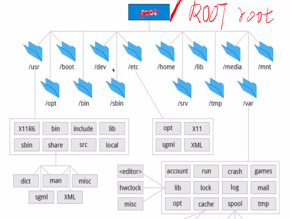
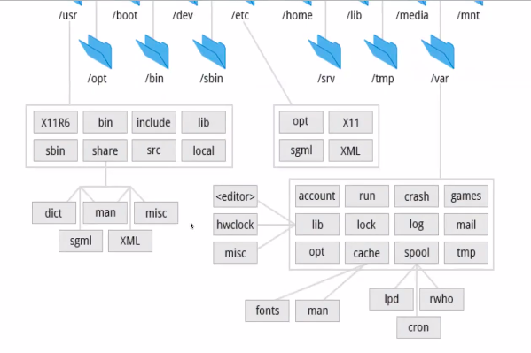
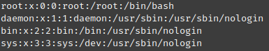
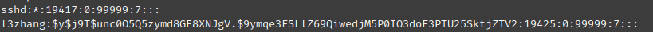
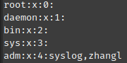
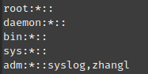

# Linux 操作系统

## prepare

### openSSH (https://www.youtube.com/watch?v=YS5Zh7KExvE)
  - connect:
    - ssh zhangl@10.10.0.214
       - -v: verbose
  - disconnect:
    - ctr + d
  - info:
    - cd .ssh
      - id_rsa
      - id_rsa.pub
      - known_host: store the public key from the known hosts
  - logfile of ssh connections
    - tail -f /var/log/auth.log
  - Configuring the Openssl Client
    - create the file 'config' under ~/.ssh/
    - ssh lltv

        ```
        Host lltv
          Hostname 172.105.7.26
          Port 22
          User root
        
        Host server2
        ...
        ```
  - Using public/private keys
    - ssh-keygen
    - copy public key to ~/.ssh/authorized_keys in server
    - ssh-copy-id -i ~/.ssh/id_rsa.pub root@172.105.7.26
  - Managing SSH keys
    - generate key for specific server
      - ssh-keygen -t ed25519 -C "acme"
        - -t: type
      - ssh -i ~/.ssh/acme_id_ed25519 root@172.105.7.26
      - add private key to key agent to store passphrase
        - ssh-add ~/.ssh/acme_id_ed25519
  - Configuring OpenSSH
    - tool: openssh-server
    - systemctl status sshd
    - systemctl restart sshd
    - systemctl stop sshd
      - connected ssh client will not be terminated, but after the disconnection, it is not possible to connect back!
    - systemctl enable ssh
      - start sshd by start the machine
    - config in server
      - ls /etc/ssh/
        - host keys is to be as fingerprint for client
      - ssh_config
        - for global client
      - sshd_config
        - config service of server
          - change port
          - disable passwordAuthentication
            - can login only with key
  - Troubleshooting OpenSSH
    - permission
      - ls -la | grep .ssh
      - cd .ssh
      - ll
      - id_rsa must be readable
    - live logs
      - Journalctl -fu ssh


## 基础知识

### 认识 shell

- CONSOLE, TERMINAL, SHELL
  - console: 带 Terminal 的桌子，工位
  - terminal: 电子设备
  - shell: 人机接口
- 全局设置与个人设置
  - System-Wide config and Setup
    - bash
      - /etc/bash.bashrc
        - 配置文件
      - /etc/bash_profile
        - 用户 session
      - /etc/bash.bash.logout
        - 退出时的操作
  - Individual(persional) config and Setup
    - bash
      - ~/.bashrc
        - 系统起来先读配置文件
      - ~/.bash_profile
        - 再读用户设置
        - 用户登陆时执行
      - ~/.bash_logout
      - ~/.input
  - 作业，写一个 bash 脚本，实现每次登出的时候显示在线了所少时间
    - $BHLVL
      - bash 的层级，系统初始化为 1， console 打开的为 2，再执行 bash 时，level 继续提升
    - shell 是一个命令解释器，赋值时不能有空格
      - Time = \`date +%s\` 相当于 执行 Time 命令，参数是 = 和 \`date +%s\`

    ```sh
    # .bash_profile
    echo save LoginTime
    LoginTime=`date +%s`
    echo ${LoginTime}

    # .bash_logout
    NowTime=`date +%s`
    echo LogoutTime
    echo ${NowTime}
    TimeSec=$[ ${NowTime} - ${LoginTime} ]
    Time=$[ ${TimeSec} / 60 ]
    echo "Login for ${Time} min"
    ```
      
### SHELL 编程基础

#### 第一个 SHELL 脚步
```sh
#!/bin/bash
echo 'Hello HaiZei' # 这是注释
```
- 执行
  ```sh
  # bash 是执行程序，a.sh 是标准输入
  bash a.sh

  # a.sh 就是执行程序
  chmode a+x a.sh
  a.sh
  ```
#### 局部变量与全局变量
- 变量的定义，是什么类型去解决于后面怎么用他
```sh
a=12
a=helloword
a=`pwd` # `命令替换符`
a=$a:a # $取值符 把 冒号和字符a 拼接在 a 的值后面
a=${a}:a # {限定变量范围} 效果同上
```
- 局部变量
```sh
local a=12
```
#### 特殊变量
- 位置变量
  - $0: 获取当前执行 shell 脚本的文件名，包括路径
  - $n: 获取当前执行脚本的第 n 个参数，n=1...9，如果 n 大于 9，则需要将 n 使用大括号括起来
  - $*: 获取当前 shell 的所有参数，将所有命令行参数视为单个字符串，相当于"$1$2$3"
  - $#: 得到执行当前脚本的参数个数 (# 有求个数的含义, #VAR_MAX)
  - $@: 获取这个程序所有参数，并保留参数之间的任何空白，相当于"$1" "$2" "$3"，这是将参数传给其他程序的最好办法
- 状态变量
  - $?: 判断上一个指令是否成功执行，0 为成功，非零为不成功
  - $$: 取当前进程的 PID
  - $!: 上一个指令的 PID
- 变量，参数展开
  - ${parameter:-word} 如果变量未定义，则表达式的值为 word
  - ${parameter:=word} 如果变量未定义，则设置变量的值为 word，返回表达式的值也是 word
  - ${parameter:?word} 用于捕捉由于变量未定义而导致的错误并退出程序
  - ${parameter:+word} 如果变量已定义，返回 word，也就是真
  - ${!prefix*}
  - ${!prefix@} prefix 开头的变量
- 字符串展开
  - ${#parameter} 输出字符串的长度
  - ${parameter:offset} 从第 offset 字符开始截取
  - ${parameter:offset:length} 从第 offset 字符开始截取，取 length 长度
  - ${parameter#pattern} 从头删除最短匹配
  - ${parameter##pattern} 最长
  - ${parameter%pattern} 从尾删除最短
  - ${parameter%%pattern} 从尾删除最长
  - ${parameter/pattern/string}  第一个匹配被替换
  - ${parameter//pattern/string} 全部匹配被替换
  - ${parameter/#pattern/string} 字符串开头的替换
  - ${parameter/%pattern/string} 字符串结尾的替换
  - ${parameter,}  ${parameter^} 首字母转换为小写、大写
  - ${parameter,,}  ${parameter^^} 全部转换为小写、大写
- 输入输出
  - read [-options] [variable...]
    -a array # 把输入复制到数组 array 中，从索引号零开始
    -p prompt # 为输入显示提示信息，使用字符串 prompt
    -s # Silent mode
    -t secodes # 超时
  - echo string
    - echo -e "Hello Haizei\n" # 开启转义
    - echo "Hello $name, This is Haizei" # 必须是 ", ' 的话 $ 就不是读取的变量的指，而是字符了
    - echo "\"Hello HaiZei\""
  - printf
    - printf "Hello %s, This is Haizei\n" "Small A"
#### 函数
- 声明定义和调用

  ```sh
  #!/bin/bash

  # 三种写法都可以

  function _printf_ {
    echo $1
    return
  }

  # 没有任何的形参
  _printf_() {
    echo $1
    return
  }

  function _printf_() {
    echo $1
    return
  }

  # 函数调用
  _printf_ "Hello Haizei"
  ```
- 流程控制
  - if
  ```sh
  # [[test表达式]]: 把里面的值转换成布尔型
  # [] 也可以，但是 [[]] 兼容性最好
  # $[] 和 $(()) 都是整数计算 $(()) 内可以少写 $
  # man test 能判断 string, integer, file 等相关操作
  # [[ ${A}x = x ]] 判断字符串是否为空

  if [[ condition ]]; then
    # statements
  elif [[ condition ]]; then
    # statements
  elif [[ condition ]]; then
    # statements
  else
    # statements
  fi
  ```
  - for
  ```sh
  for i in words; do
    #statements
  done

  for (( i = 0; i < 10; i++ )); do
    #statements
  done
  ```
  - while
  ```sh
  while [[ condition ]]; do
    #statements
  done
  ```
  - until
  ```sh
  # 直到 condition return true，都做这个事情
  until [[ condition ]]; do
    #statements
  done
  ```
  - case
  ```sh
  case word in
    pattern )
      ;; # 相当于 break
  esac
  ```
### 数组
- 声明
  - declare -a a
- 赋值
  - name[subscript]=value
  - name=(value1 value2 ...)
```sh
files=(`ls`)
echo ${files} # 输出的是第一个元素，类似 C 里的首地址
echo ${files[0]}
echo ${files[*]} # *: 输出数组内容
echo ${files[@]} # @: 输出数组内容
echo ${#files[@]} # #: 输出元素个数
echo ${!files[@]} # !: 输出数组下标（有值的）
files[10001]="HAHAHA" # 数组长度不定长
unset files # 删除整个数组
unset files[13] # 删除某个值
files+=(`ls`) # 数组的追加
```

## 系统与编码环境

### MAN

- 移动, 查找如同 vim /..
- man 手册分为 9 种
  - man -k reboot
    - 查找所有和 reboot 相关的文档
  - man -f reboot
    - 查找 reboot 文档

|代号|代表含义|举例|
|-|-|-|
|1|用户在 shell 环境下可以操作的命令或可执行文件|man 1 ls|
|2|系统内核可调用的函数和工具|man 2 reboot|
|3|一些常用的函数与函数库，大部分 C 的函数库|man 3 readdir|
|4|设备文件的说明，通常是在 /dev 下的设备|man 4 null|
|5|配置文件或某些文件的格式|man 5 interfaces|
|6|游戏|man 6 lol|
|7|惯例与协议等，例如 Linux 文件系统，网络协议等|man 7 tcp|
|8|系统管理员可用的命令|man 8 reboot|
|9|跟 kernel 有关的文件||
|o|旧文档||
|n|新文档||
|i|本地文档||

### Shell 通配符

- ?
- \*

|通配符|含义|举例|
|-|-|-|
|[list]|匹配 list 中的任意单一字符||
|[!list]|匹配除了 list 中的任意单一字符||
|[c1-c2]|匹配 c1-c2 中的任意单一字符||
|{string1,string2,...}|匹配 string1 或 string2 其一字符串||

### Shell 任务控制

- $ : 后台执行
  - command &
- ; : 顺序执行
  - command1;command2
- && : 只有第一个成功执行，第二个命令才会执行
  - command1&&command2
  - 已经有一个 false 了，返回 false
- || : 第一个成功执行，第二个命令不会执行, 第一个失败里，执行第二个
- `` : 命令替换符，优先执行 \`\` 里的命令，结果返回给父命令
- ctrl + z : 挂起，相当于阻塞这个进程，把内存置换出来到 swap 区
- jobs: 列出挂起的任务
- fg [n]: 后台命令回到前台
- bg [n]: 前台命令回到后台

### 管道与重定向

- \>: 重定向符，命令到文件，覆盖
- \>\>: 追加
- <: 文件的内容作为命令调用的参数
- <<: 以什么符号作为文件结束
  - cat > a.log << EOF
    - cat 后的标准输入被存到 a.log 里，直到 EOF
    - EOF: (end of file, ctrl + d)

### tldr (Too Long; Didn't Read) 的使用

- 通过网络获取信息
- 红色字是固定内容，白色根据需求改动

### LINUX 系统信息

- uptime [phsv]
  - 打印系统运行时长和平均负载
- w [husfoi]
  - 当前登录用户列表及正在执行的任务
  - JCPU: 和改终端想连接的素有进程占用的时间，包含当前正在执行的后台
  - PCPU: 当前进程所占用的时间
  - WHAT: 当前进程正在执行的命令
- who [Huq]
  - 显示当前登录系统的用户信息
- whoami
  - 打印当前有效的用户名称
- logname
  - GUI 登录的不算登录
- id 查看当前用户具体信息
- last [fnx]
  - 显示用户最近登录信息
  - 默认读取文件
    - la -al /var/log/wtmp
    - 储存的数据文件
  - -f 读取文件
- uname [a]
  - 打印当前系统信息
- date [dsu] <+日期格式>
  - 显示或这只系统时间与信息
  - date +%H:%M:%S
  - 自动同步 ntp，其实不需要设置 -s
- cal
  - 显示日历

## 目录结构

- tree

  
  

- 一级目录
  - /usr: 普通用户级别的文件
  - /dev: 设备
  - /etc: 全局配置文件
  - /home: 所有用户的家目录所在地
  - /lib: 系统库
  - /media: 挂载光盘的，基本没有了
  - /mnt: mount, 挂载目录
  - /opt: 可选目录
  - /bin: 二进制文件
  - /tmp: 临时文件, 777, 重启后会丢失，只有森见的创建者才可以删除
  - /var: 动态数据目录，logs, cache

```sh
mkdir 198
cd 198
mkdir mnt
cd mnt
touch a
cd ../..

tree

# 挂载远端的 pi 的登录目录树，家目录到当前下的 mnt，允许 mnt 非空
sshfs -o nonempty pi@pi3:. ./mnt
# 卸载 ./mnt 上挂载的目录树
umount ./mnt

# 查看目录应用
df -h
```

## 文件与目录的操作

- 常用命令
  - makedir [-pm]
  - ls [-alhd]
  - cp [-apdrslu] <sour> <des>
  - rm [irf <dir_or_file>]
  - mv [-ifu] <source...> <dest>
  - dirname
  - basename
  - cat [-A]
  - tac
  - nl 显示行号的方式输出文件
  - more
  - less
  - head
  - tail
- 练习
  - 如何查看一个文件的第 101 行到 120 行？
  - man ls | nl -b a -n rz -w 3 > a.log
  - tail -n +101 ./a.log | head -n 20

## 文件时间与隐藏属性

- 常用命令
  - OD 二进制文件查看
- 修改文件时间与新建文件
  - 文件的三个时间
    - mtime: 内容数据改动时才更新这个时间
      - modify
    - ctime: 文件的权限，属性改动时更新这个时间
      - chmod
      - chown
    - atime: 文件的内容被取用时，更新这个时间
      - access
    ```sh
    ls -l --time=ctime /etc/hostname
    ```
- 修改文件时间与新建文件
  - touch [-acdmt] <file>
- 文件隐藏属性
  - chattr [+-=] [ASacdistu] <file_or_dir>
    - A: 不修改 atime，网站访问被频繁修改，性能考虑，可以关掉
    - S: 同步写入, 一般是异步，应用程序到内核，内核可能等待一些一起再写入
    - a: 只增加数据, 一般用在关键日志上
    - c: 自动压缩，解压，一般不这么做
    - d: 不会被 dump 程序备份
    - i: 不能删除，修改，建立链接
    - s: 文件删除时，直接从磁盘删除
    - u: 文件删除时，数据内容存在磁盘中, 默认情况
  - lsattr [-adR] <file_or_dir>

## 文件的特殊权限

- set_uid
  - 标识符: s (放在 user x 的位置，如果是 s+x，标记为 s，如果只有 s，标记为 S)
  - 作用对象: 二进制程序文件，非脚本
  - 效果: 用户在执行该程序时，获取程序所有者权限
  ```sh
  # /etc/shadow 储存加密过的用户密码
  cat /etc/shadow
  # permission denied

  # 但是通过 passwd 命令在没有 root 权限的情况下就可以修改密码
  ls -al `which passwd`
  # -rwsr-xr-x 1 root root 59976 Nov 24 13:05 /usr/bin/passwd
  # others 有可执行权限，在执行时 user 的 s 权限临时授予了用户 root 权限
  ```
- set_gid
  - s
  - 目录和二进制程序文件
  - 用户在该目录里，有效组变为目录所属组
  ```sh
  chmod g+s L3
  ls -lad L3
  # drwxrwsr-x 3 zhangl zhangl 4096 Jan 30 12:57 L3
  chmod o+w L3
  sudo useradd -m l3zhang
  sudo passwd l3zhang
  su - l3zhang

  # switch user to l3zhang
  cd ~zhangl
  cd L3
  touch fileFroml3zhang
  ls -la fileFroml3zhang
  # -rw-rw-r--  1 l3zhang zhangl    0 Mar  9 16:40 fileFroml3zhang
  # group 是 zhangl，不是 l3zhang
  ```
- sticky Bit
  - t: t 有 x 权限, T 只有 t 权限
  - 目录
  - 在该目录下，用户只能删除自己创建的内容
  ```sh
  ls -lad /tmp
  # drwxrwxrwt 18 root root 4096 Mar  9 16:53 /tmp
  cd /tmp
  ls -la
  # drwxrwxrwt  2 root   root   4096 Mar  9 15:27 .Test-unix
  rm -rf .Test-unix
  rm: cannot remove '.Test-unix': Operation not permitted
  ```
 - 练习
  - 新建一个群组 TestGroup
  - 在自己的 Linux 系统中新建两个用户 UserA 和 UserB
  - 假设现在有一个项目需要由 A，B 两位用户同时对项目有读写权限，使用 root 用户创建一个目录，实现 A，B 两位用户都能够读写新建文件
    - UserA 新建的文件，可以直接被 UserB 读写
    - UserA UserB 只能删除自己创建的内容
    - 其他用户不能读取该项目目录

    ```sh
    sudo groupadd TestGroup
    sudo useradd UserA
    sudo passwd UserA
    sudo useradd UserB
    sudo passwd UserB
    sudo useradd UserC
    sudo passwd UserC
    mkdir TestLP
    chgrp -R TestGroup TestLP
    sudo usermod -a -G TestGroup UserA
    sudo usermod -a -G TestGroup UserP
    sudo chmod o-x TextLP
    sudo chmod +t TestLP
    # 通过 strace 可以查看到函数调用
    # >> 里调用了 create，是没有权限的
    # 新的内核更改里安全机制，默认是 2
    # https://www.kernel.org/doc/html/latest/admin-guide/sysctl/fs.html#protected-regular
    echo 0 >> /proc/sys/fs/protected_regular
    ```

# 命令与文件查找
- which 寻找可执行文件
  - 查找 PATH 路径下的可执行文件
- whereis [-bmsu] 寻找特定文件
- locate [-ir] 搜索文件（可部分查找）
  - 快，因为把文件名做里意识数据库
  - 但找不到最近更新的
  - updatedb 重新整理数据库
- find [PATH] [option] [action] 多样化高级查找
  - 与时间相关的参数:
      - -mtime n
      - -mtime +n
      - -mtime -n
      - -newer file
    ```
    # +n file     n   -n
    # =====file===n========today===
    ```
  - 与用户或用户组相关的参数
    - -uid n:
    - -gid n:
    - -user name
    - -group name
    - nouser
    - nogroup
  - 与文件权限及名称相关的参数
    - -name filename
    - -size [+=] SIZE
    - -type TYPE
      - f b c d l s p
    - -perm mode
    - -perm -mode
  - find [] -exec ls l {} \;
    - find . -name "*.log" -mtime -1 -exec wc -l {} \;
- 练习
  - 求出家目录下，所有 .c, .cpp, .sh, .h 文件的总行数
  ```sh
  find . \( -name "*.c" -or  -name "*.cpp" -o -name "*.h" -or -name "*.sh" \) -exec wc -l {} \; | awk '{sum += $1} END {print sum}'
  ```

  ## 实现 ls 需要用到的函数

  - env -> LS_COLORS
  - opendir
    - if success, return the pointer to the first entry of stream
    - if not, return NULL and errno
    - errno: error number
      - perror: print error message, 相当于 throw new Error()

        ```c
        #include <stdio.h>
        #include <stdlib.h>
        
        int main(void)
        {
          FILE *fh;
        
          if ((fh = fopen("mylib/myfile","r")) == NULL)
          {
              perror("Could not open data file");
              abort();
          }
        }
        ```
  - readdir
    - return the pointer to the next directory entry
    - 得用循环结构读取, return NULL if touch the end
  - closedir
  - 2 stat
    - reutrn infomation about a file, in the buffer pointed to by statbuf
  - getpwuid
    - return passwd struct
  - getgrgid
    - return group struct

## 数据提取操作

- cut [-dfc] <file>
  - 切分
  ```sh
  export | cut -c 12-
  export | cut -d " " -f 3-
  ```
- grep [-acinvw] <string> <file>
  - 检索
- sort [-fbMnrtuk] <file_or_stdin>
  - 排序
  ```sh
  cat /etc/passwd | sort -t : -k 3 -n -r
  ```
- wc [-lwm] <file_or_stdin>
  - 统计字符，字数，行数
  ```sh
  last | grep -v "wtmp" | grep -v '^$' | wc -l
  last | grep -v "wtmp" | grep -v '^$' | cut -d " " -f 1 | sort -u
  ```
- uniq [-ic]
  - 去重，先排序在去重，不然被隔开的重复内容会被计算多次
  ```sh
  last | grep -v "wtmp" | grep -v '^$' | cut -d " " -f 1 | sort | uniq -c
  ```
- tee [-a] file
  - 双向重导向
  ```sh
  # ls 的内容不止输出到 d.log，还输出到 stdout
  ls | tee d.log
  ```
- splite [-bl] <file> PREFIX
  - 切分文件，默认储存在当前位置
  ```sh
  split -l 10 a.log a.log_
  ```
- xargs [-0pne] <command>
  - 前一个命令的标准输出转化外后一个命令的参数，而非标准输入流
  ```sh
  cat /etc/passwd | cut -d ":" -f 1 | xargs -n 1 id
  # 读到 "proxy" 就结束
  cat /etc/passwd | cut -d ":" -f 1 | xargs -eproxy -n 1 id
  ```
- tr [-cdst] <字符集> <字符集>
  -替换，压缩和删除
  ```sh
  ls | tr [a-z] [A-Z]

  for i in `ls`; do
  mv $i `echo $i | tr [a-z] [A-Z]`
  done

  # 统计单词出现的字数
  cat A.LOG | tr -s -c [a-z] ' ' | tr ' ' '\n' | sort | uni -c | sort -n -r | head -n 20
  ```

## 用户管理

### 用户管理的重要配置文件
- /etc/passwd

  
  - 用户名
  - 密码位
    - 早期是写密码的，但为了安全，存到 shadow 了，x 当占位符
  - 用户编号
  - 归属组编号
  - 姓名
  - $HOME
  - $SHELL
- /etc/shadow

  
  - 用户名
  - 已加密密码
  - 密码改动信息
  - 密码策略
    - 密码不可改动时间
    - 密码需要重新修改的时间
    - 密码变更期限前警告时间
    - 密码过期宽限时间
    - 帐号失效日期
    - 保留
- /etc/group

  
  - 群组名
  - 密码位
  - 群组编号
  - 组内用户
- /etc/gshadow

  
  - 组名
  - 密码
    - ！： 没有密码
  - 群组管理员
  - 加入该群组的所属帐号
- /etc/sudoers
  - 用户名
  - 权限定义
  - 权限
  - (sudo)

### 用户命令
-su [-lmpfc] <username>
  - 切换用户
- sudo [-siul] <command>
  - 临时切换为 root 用户
- passwd [-dleSxnf] <username>
  - 设置用户密码
- gpasswd [-adrAM] <groupname>
  - 设置群组密码
- usermod [-cdefgGlLsuU] <username>
  - 修改用户账户
- useradd [-dmMsugGnefcD] <username>
  - 新建用户 (adduser)
  - /etc/login.defs
    - 新建用户规则
  - /etc/skel/
    - 新建用户默认文件
- userdel [-r] <username>
  - 删除用户
- id [-gGnru] <username>
  - 显示用户信息
- chsh -s Shell <username>
  - 更改用户 shell

### 练习
- 新建一个用户 Admin
  - 密码 100 天后过期，提前 7 天提醒， 过期 10 后不修改密码将关闭帐号
  - 定义 SHELL，有 HOME
  - 登录自动打印欢迎信息: Welcom Admin(提取变量)! Today is 2017-09-27
    - 并且打印最后一次登录的详细信息和最近登录的总次数
  - 可直接执行 my_ls
  - 可执行 sudo 命令

```sh
sudo useradd -m Admin
sudo passwd Admin
sudo usermod -g sudo Admin
sudo usermod -g sudo zhangl
sudo vim /etc/shadow
# Admin:$y$j9T$WT356INmM.WYo629WeTdG1$TseJn3y79uy6WHT.Mc/p9Rhj90qH1gd2NfPss5L9yHD:19431:0:10:7:10:19531:
sudo vim /etc/passwd
# Admin:x:1005:27::/home/Admin:/bin/bash
sudo vim /home/Admin/.bash_profile
```

```sh
#!/bin/bash
# .bash_profile
 echo Hello `whoami`! Tody is `date +%F`
 LOG_FILE='loginAdmin.log'
 i=1
 while read line; do
         case $i in
                 1)
                         LAST_LOGIN_ADMIN=$line
                         ;;
                 2)
                         LOGIN_CNT_ADMIN=$line
                         ;;
                 *)
                         echo finish
                         ;;
         esac
         i=$((i+1))
 done<$LOG_FILE
 
 echo last login: ${LAST_LOGIN_ADMIN}
 echo total login times: ${LOGIN_CNT_ADMIN}
 
 date > $LOG_FILE
 echo $((LOGIN_CNT_ADMIN + 1)) >> $LOG_FILE
```

## 进程与任务管理
### 进程管理

- free [-bkmgtsh]
  - 打印系统情况和内存情况
- top
  - 显示当前系统进程情况，内存，CPU等信息
  - htop
- dstat
  - 实施监控磁盘，CPU，网络等
  - 可以输出 .csv
  - nmon
- ps [-aux / -ef]
  - 报告当前进程状态
  - ps -aux | grep ssh
- pstree [-apnul]
  - 以树状显示进程派生关系
- pgrep [-onlpgtu] <进程名>
  - 查找进程 ID
- kill [-9] <pid>
  - 删除执行中的程序和工作
  - 对莫个进程发送 9 状态
- pkill [-onpgt] <进程名>
  - 批量按照进程名杀死进程

### 任务管理
- cron
  - 定时任务
  - crontab -e 编辑
  - crontab -l 显示列表
  ```
  *   *   *   *   *   command
  分  时  日  月  周
  */5 每 5 分钟
  ```
  - crond 守护进程
- at [ldc] <args>
  - 在制定的时间执行一个指定的任务
  - atd 守护进程
- sleep
  - 睡眠，等待多长时间后执行