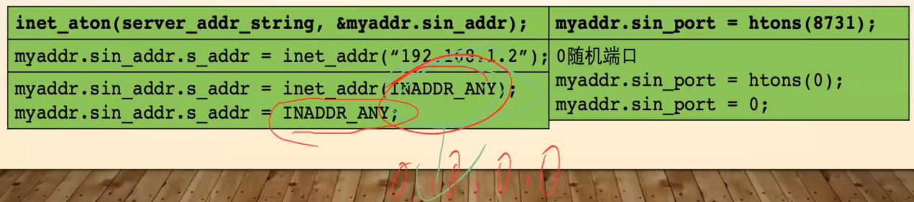

# 操作系统与系统编程

## 文件与目录操作

### 相关命令实现

#### 使用 getopt 解析命令行参数

- 参数(arguments)和选项(option)的区别
	- ls -a /etc
		- -a 选项
			- a 选项字符 (option character)
		- /etc 参数
- man 3 getopt

```
// 参数和 main 函数相同
int getopt(int argc, char * const argv[],
				const char *optstring);

// 全局变量
extern char *optarg;
extern int optind, opterr, optopt;

// example

#include <unistd.h>
#include <stdlib.h>
#include <stdio.h>

int main(int argc, char *argv[]) {
	int flags, opt;
	int nsecs, tfnd;

	nsecs = 0;
	tfnd = 0;
	flags = 0;

	// optstring: "nt:", n 选项没有选项参数, t 选项有选项参数
	while ((opt = getopt(argc, argv, "nt:")) != -1) {
		// optind shows the index of next element to be processed in argv array
		switch (opt) {
		case 'n':
			flags = 1;
			break;
		case 't':
			// atoi: 字符串专成整形
			nsecs = atoi(optarg);
			tfnd = 1;
			break;
		default: /* '?' */
			// fprintf: 打印到一个文件 (stderr)
			fprintf(stderr, "Usage: %s [-t nsecs] [-n] name\n",
					// argv[0]: 程序自己
					argv[0]);
			// 宏定义，错误推出状态
			exit(EXIT_FAILURE);
		}
	}

	printf("flags=%d; tfnd=%d; nsecs=%d; optind=%d\n",
			flags, tfnd, nsecs, optind);

	// 索引值大于参数数量，就是没跟参数
	if (optind >= argc) {
		fprintf(stderr, "Expected argument after options\n");
		exit(EXIT_FAILURE);
	}

	// 如果 getopt() 返回了-1,表示目前没有更多的选项可解析了,且 optind 的值比argc要小,那么 argv[optind]就表示命令行中下一个非选项单词
	printf("name argument = %s\n", argv[optind]);

	/* Other code omitted */

	exit(EXIT_SUCCESS);
}
```

#### ls 命令的实现 (ls.c)

- 处理选项
	- getopt()
- 处理参数
	- ls .
	- ls /etc
		- do_ls in 04linuxOS/ls.c
	- ls a.log
		- If "opendir: Not a directory", echo the name of file

#### more 命令的实现 (more.c)

- 实现 more 需要的函数
	- fopen
		- stream open functions (打开文件流)
	- fread
		- 把流吸入到一个 buffer 中，比如 string
	- fgets
		- 一行一行的把流写入 buffer 中
	- fputs
		- 把 string 写入流中
	- fclose

#### more 命令的实现 (cp.c)

- file descriptor 文件描述符
	- fopen 返回 file stream，还有另外一种打开文件的返回方式 open 返回 file descriptor 文件描述符
	- 
- 实现 cp 需要的函数
	- open
		- 可以打开文件也可以新建文嘉
	- create
		- 可以被 open 代替
	- ssize_t read(int fd, const void *buf, size_t count);
		- 从 fd 顺序读出并存入 buf 中，最长读 count 个字节
	- ssize_t write(int fd, const void *buf, size_t count);
		- 从 buf 读出并存入 fd 中, 最长 count 个字节
	- strlen
	- close
	- sizeof

### 阻塞 IO 与 非阻塞 IO

视频不完整，用 研发工程师_操作系统编程_第4章_高级IO1 作为补充

- 阻塞 (进程)
	- 三态模型 (进程的状态)
		- ready
		- block
		- running
	- CPU 分时间片启动 ready 的进程，进入 running
	- running 是遇到资源等待会进入 block
	- IO 结束后进入 ready，等待 CPU 继续执行
	- block vs 挂起 (sleeping)
		- block
			- 进程状态：等待进程需要的资源, 数据
		- sleeping
			- 进程调度：原先执行，现在不执行，把它的状态保存下来
	- 阻塞类型
		- IO 阻塞
		- 进程阻塞
		- 函数阻塞
			- recv，连接上了，在等发送
			- accept, 等待接收 syn 报文 (在函数上的阻塞也算是 IO 阻塞)

- 阻塞 IO VS 非阻塞 IO
	- 非阻塞
		- 同步
			- 不等，但要一直问是否完成
		- 异步 IO
			- 回调函数
	- IO 默认是阻塞的
		- 设置 IO 方式
- 非阻塞 IO 的实现与演示
  - ioctl 函数 control device (file)
    - int ioctl(fd, int FIONBIO, *) // (fiel descriptor, nonblock IO, unsigned long pointer)
  - fcntl 函数 manipulate file descriptor
    - int fcntl(int fd, int cmd)
- select / pselect
	- 监控多个文件描述符，看他是否就绪
	- pselect
		- 可以通过定义 sigmask 忽略别的信号

#### 非阻塞 IO 的实现与演示

- !!! 学完 server 再回来扩展 ！！！

#### 作业讲解：fcntl 的使用方法

- !!! 学完 server 再回来扩展 ！！！

### 缓冲 IO

研发工程师_操作系统编程_第4章_高级IO1 作为补充

#### 缓冲 IO 的介绍

- 三种缓冲机制
	- nonbuffered (unbuffered)
	- block buffered (fully buffered)
		- 默认文件操作都是 block buffered
		- 用 fflush 清空缓冲(fprintf()) 并显示
		- block vs inodes
			- All Unix filesystems use two basic components to organize and store data: blocks and inodes.
			- Just as a physical disk is organized into sectors, data on a filesystem is abstracted into blocks. Blocks have a fixed size, determined at the time the filesystem is created. The block size of a filesystem determines how many bytes are allocated to each block on the filesystem. Generally, block sizes are 1 KB, 2 KB, or 4 KB for 32-bit systems. A block size of 8 KB is also available on 64-bit systems.
			- Inodes are used to map blocks to physical disk locations on Unix filesystems. Every file created, whether it’s a directory, normal file, or special file, is assigned an inode. Inodes work in much the same way as pointers do in programming languages such as C, Perl, and Java. Inodes also store information about a file, including its type, size, and parent directory. On traditional Unix filesystems, inodes are typically allocated when the filesystem is created. ext2, for example, allocates one inode for every 8 KB worth of data blocks when a new filesystem is initialized, although this value can be manually altered. That means an ext2 filesystem with a block size of 4 KB allocates a single inode for every two data blocks.
		- block
			- 文件 IO 中的基本单位
			- 常见块大小 (byte)
				- 512， 1024, 2048, 4096
				- 查看方式
					- stat -f .
		- 标准 IO，比如 fread，有什么缺陷
			- 两次拷贝
				- 读操作: 文件 -> 内核 -> 用户空间
				- 写操作：文件 <- 内核 <- 用户空间反向
	- line buffered
		- 默认终端操作都是 line buffered
		- 换行就清空
- 更改缓冲机制
	- SETBUF
- 拓展阅读
	- 直接 IO
		- VS buffered IO

		

		- 不经过内核缓存，直接从 std buffer 写入到文件系统
	- 同步 IO 
		- 阻塞IO模型
			- 用户线程发起 io 请求并阻塞用户线程释放 CPU 执行权，等待内核态的 io 处理完成。
		- 非阻塞IO模型
			- 用户线程发起 io 请求会立即返回处理后面的代码，但是会有线程以轮询的方式查询内核态的 io 是否处理完成，如果 io 完成则立即拷贝到用户进程，这种方式对 CPU 资源消耗较高。
		- IO复用模型
			- 多路复用模型是由一个线程(select)监听多个 socket，这种方案比较适用于 io 比较多的情况，io 多路复用的性能是比非阻塞 io 要高的，因为多路复用模型的轮询是在内核态，而非阻塞 io 的轮询是在用户态，但是在任务数量比较多或比较大的情况下 io 多路复用需要逐一去处理已完成的 io，会导致后续的 io 得不到处理或者等待过长时间才能得到处理
		- 信号驱动的IO模型
			- 用户线程发起 io 请求，然后给负责 io 的 socket 注册一个函数用于完成后的回调，当内核态数据准备完成后会发出一个信号，用户线程接收后会调用之前注册的函数来读写 io (回调函数)
		- VS async IO 
			- 异步IO模型
				- 用户线程发起 io 请求后会立即返回，并当内核态的 io 完毕后会将数据拷贝到用户态，然后再发送信号通知用户线程已就绪，整个过程用户线程是不会阻塞也不需要其它额外操作的，除了发起 io 请求，处理 io 和拷贝数据均由内核态完成。

#### 内核和缓冲 IO

- 储存文件案例

	

	- 文件储存在用户 Buffer，然后交给 std IO buffer，因为是文件，所以是 fully buffer
	- 转存到 kernel 的 IO, 等到合适的时机，比如缓存的文件足够过，或者和其他文件一起组合，内核在写入文件系统 (回写机制 !!!)
	- 两次拷贝
		- 文件驱动器变为字节流交给内核
		- 内核等待用户来读
		- 先在 std IO 中缓存起来 (第一次)
		- 最后到用户 buffer 中 (第二次)
	- 内核的预读机制 !!!
		- 内核会猜测下一段数据用户也要，就会多读 bit
		- 当预先读取的 bit 被用到了，就会读等多的 bit
		- 直到用户而不需要了，就会放弃这段读取
		- 下次再从多读 1 bit 开始
	- 套接字和管道没有内核转存到文件系统这一步，所以不作数

### IO 多路复用 (IO 多路转接)

#### IO 多路服用的引出

- 其他多并发方法
	- 多进程
		- 缺陷
			- 进程数量有限制 (一般最多 1024)
			- 代价太高
				- 销毁和创建
				- 进程间切换
			- 受限于 cpu 核心数
				- 并不是真实的并发
			- 内存隔离
				- 进程间通信代价高
	- 多线程(线程池)
		- 受限于 CPU，影响响应能力
		- 阻塞
			- 阻塞，要等，响应能力差
			- 非阻塞的话，输出没有数据就会报错，等下还得再来看(循环检测)
- 作用
	- 感知 IO，看 IO 是否就绪

#### select 的介绍

- 相关函数
	- select(int nfds (最大描述符的数字 + 1), fd_set *readfds, fd_set *writefds, fd_set *exceptfds, struct timeval *timeout);
		- ready:
			- read: 数据从内核缓冲空间拷贝到用户缓冲空间
			- write: 有足够的空间

#### select 的一个小例子

- example in man
	- man select | cat -n | head -n 322 | tail -n +289 | cut -c 15-
- 理解

	

	- 在没有回车的情况下，tv 结束后，因为 stdin 是行缓冲，所以输入内容并没有从 用户 butter 转存入 内核 buffer，所以 select 的监控并没有得到内容
	- 按下回车后，把数据从用户缓冲传给内核，内核判定数据可读。但这个程序并没有清空 stdin 的缓冲区（并没有读），所以结束后，缓冲区的内容会被 Terminal 拿到。如果缓冲区中有回车，内容会被当作命令去执行

#### 使用 select 实现 socket_connect_timeout 函数

- !!! 学完 server 再回来扩展 ！！！

#### 使用 select 实现 echo 服务器

- !!! 学完 server 再回来扩展 ！！！

#### 使用 select + 自定义 buffer 实现 echo 服务器

- !!! 学完 server 再回来扩展 ！！！

#### poll 的讲解

- int poll(struct pollfd *fds, nfds_t nfds, int timeout);
  
  ```
  struct pollfd {
      int   fd;         /* file descriptor */
      short events;     /* requested events 要监控的事件(掩码的形式，记录在 poll.h 中)*/
      short revents;    /* returned events */
  };
  ```

#### 使用 poll 实现 echo 服务器

- !!! 学完 server 再回来扩展 ！！！

#### epoll 的 API 讲解

- epoll - I/O event notification facility
  - int epoll_create(int size);
  - int epoll_ctl(int epfd, int op, int fd, struct epoll_event *event);
  - int epoll_wait(int epfd, struct epoll_event *events, int maxevents, int timeout);
  - trigger modes
    - edge-triggered (ET)
      - 像水波纹，只有在感知到的时候才响应，过去了就不响应了
      - 服务器处理一般用边缘模式
        - 事件过去了就过去了，效率要高很多
    - level-triggered (LT)
      - 经过之后，一直可以响应
- select VS poll VS epoll
  - select: 因为 select 要打开文件，操作系统对每一个进程打开文件数量有限制，默认最高 1024,所以 select 最高并发 1024 个
  - poll: 提供的是一个数组，把 select 的多次遍历(分别在 read, write, error 数组中)改为在数组中的一次, 通过 revent (return event) 知道到底是三个中的那个有了通知

##  网络编程

### TCP 套接字编程基础

#### socket 编程基础

- SOCKET() 创建 SOCKET
  - int socket(int domain, int type, int protocol); (安装个门)
    - domain:
      - AF_INET (IPv4), AF_INT (IPv6), AF_LOCAL, AF_ROUTE
    - type:
      - SOCK_STREAM, SOCK_DGRAM, SOCK_PACKET, SOCK_SEQPACKET
    - protocol: (如果前面两个已经能决定第三个的值了，写 0 及可以了)
      - IPPROTO_TCP, IPPROTO_UDP, IPPROTO_STCP, IPPROTO_TIPC
  - 返回值: Socket 文件描述符
- BIND() 绑定 IP 地址及端口 (确定门牌号)
  - int bind(int sockfd, const struct sockaddr *addr, socketlen_t addrlen);
    - sockfd:
      - 调用 socket 返回的文件描述符
    - addr:
      - 是指向数据结构 struct sockaddr 的指针，它保存你的地址（即端口和 IP 地址）信息。
    - addrlen:
      - 设置为 sizeof(struct sockaddr)
    - 返回值: -1 为错误，并设置 errno
- 相关结构体
  
  ```
  // 一般不用这个结构体，sa_data 不好用
  struct sockaddr {
    sa_family_t sin_family; // 地址族 (IPv4, IPv6, local, ...)
    char sa_data[14]; // 14 字节，包含陶机子中的目标地址和端口信息 (0, 0, 0, 0: 接收所有 ip 地址来的数据，如果本机有多个 ip 地址的话; 123 ,456, 789, 0: 只接收从这个 IP 来的数据; 端口同理)
  }

  struct sockaddr_in {
    sa_family_t sin_family /* address family: AF_INET */
    in_port_t sin_port /* port in network byte order */
    struct in_addr sin_addr; /* internet address */
  }

  /* internet address */
  struct in_addr {
    uint32_t s_addr; /* address in network byte order */
  }
  ```

- BIND() 绑定 IP 地址
  - int bind(int sockfd, const struct sockaddr *addr, socketlen_t addrlen);
  - htons() 作用是将端口号由主机字节序转换为网络字节序的整数值 // HostToNetworkShort
  - htohl() 相反
  - inet_addr() 作用是将一个 IP 字符串转化为一个网络字节学的整数值，用于 sockaddr_in.sin_addr.s_addr。 (192.168.1.2 => 无符号 32 位整型)
  - inet_ntoa() 作用是将一个 sin_addr 结构体输出成 IP 字符串

    

- 网络字节序与主机字节序（大小端）

	

	- 主机字节序依据 cpu 不同，分大小端。红字为小端例子
	- 网络字节序不变，始终是大端: 低地址存高位 （192.168.0.1 中的 192 最先）
	- 字节序的转换一定要做，因为还要在别的机器上跑

- listen() 监听 SOCKET
	- int listen(int sockfd, int backlog);
		- sockfd: 调用 socket() 返回的套接字文件描述符
		- backlog: 进入队列中允许的链接数目
- accept() 接收链接
	- int accept4(int sockfd, struct sockaddr *addr, socklen_t *addrlen, int flags);
	- accept() 用来接受参数 sockfd 的 socket 链接。参数 sockfd 的 socket 必须先经 bind(), listen() 函数处理过，当有连线进来时 accept() 会返回一个新的 socket 处理代码，往后的数据传送与读取就是经由新的 socket 处理。而原来参数的 sockfd 的 socket 能继续使用 accept() 来接收新的连接请求。连线成功时，参数 addr 所指的结构会被系统填入远程主机的地址数据，参数 addrlen 为 sockeaddr 的长度
- connect() 建立链接
	- int connect(int sockfd, const struct sockaddr *addr, socklen_t addrlen);
		- socketfd
		- addr 保存着目的地端口和 IP 地址的数据结构 struct sockaddr
		- addrlen 设置为 sizeof(struct sockaddr)
		- 不需要 bind, 系统会分配端口号
- getpeername() 获取对端地址
	- int getpeername(int sockfd, struct sockaddr *addr, socklen_t *addrlen);
- gethostname() 获取本机地址
- close()
- send() 发送数据
	- 本质是向 buf 里 write 数据
	- ssize_t send(int sockfd, const void *buf, size_t len, int flags);
- recv() 接收数据
	- 本质是从 buf 里 read 数据
	- ssize_t recv(int sockfd, void *buf, size_t len, int flags);

### Server 端的实现

- serverV1.c

### Client 端的实现

- clientV1.c

### 使用多进程优化 Server 端

- 进程是可以克隆的 (clone)，但是这个命令只能内核层面调用
- 用户层面可以用 fork，创建子进程
- 父进程和子进程之后独立运行

	