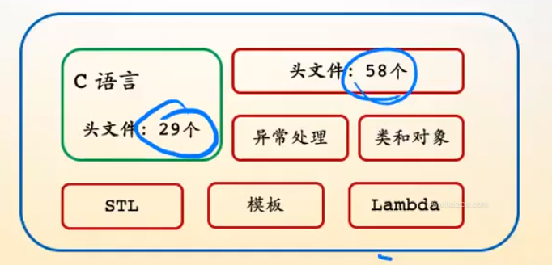
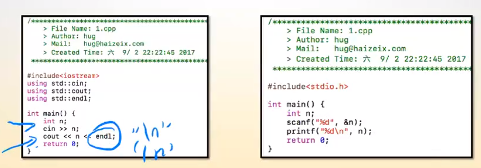
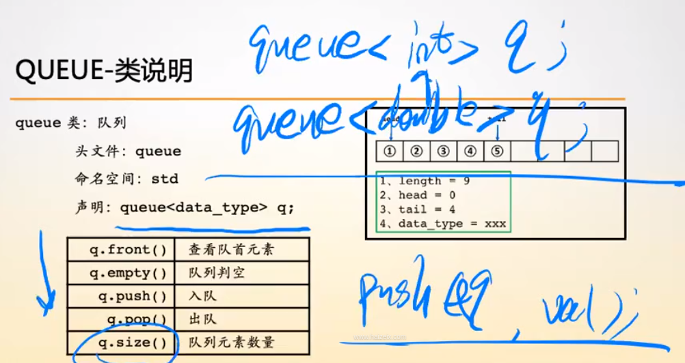
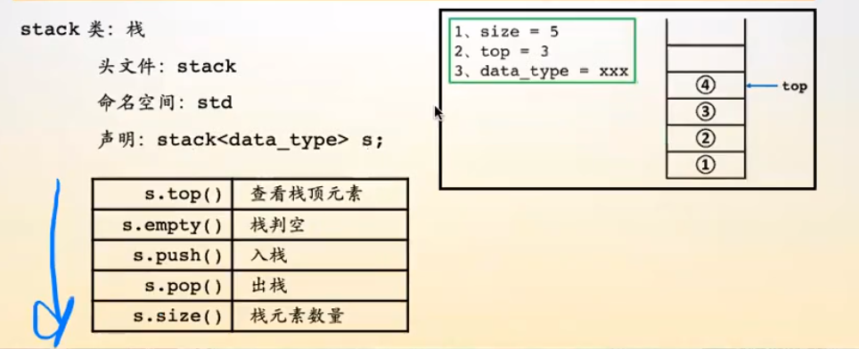
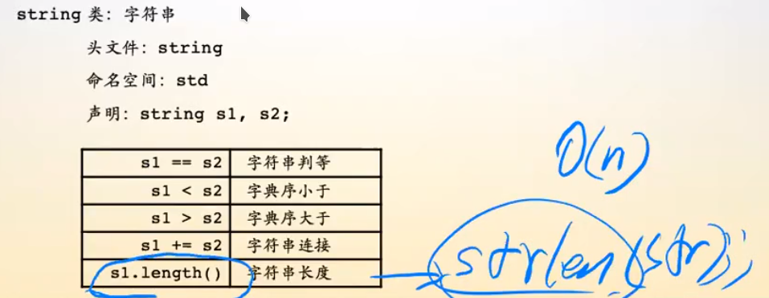
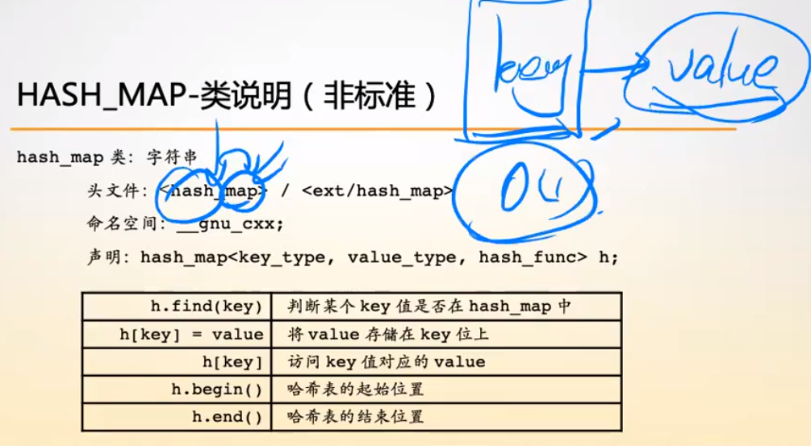
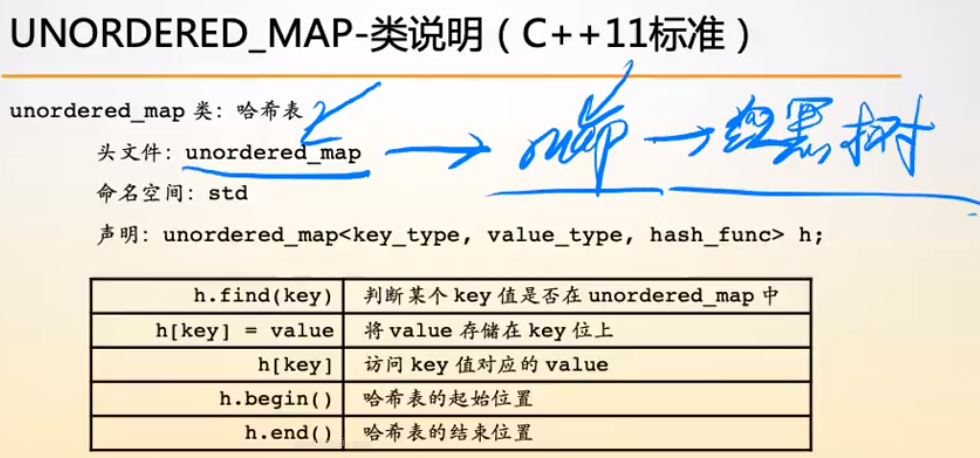

# C++

## C++ 程序设计

### 从 C 到 C++

#### C++ 语言简介

- C 的超级
  
  - 继承了 C 所有的东西
  - 支持四种编程范式
    - 面向过程
    - 面向对象
    - 泛型编程
    - 函数式编程
  - 数据结构 STL
- C++ 学习方法
  - 因为支持的编程范式多，所有语法特性特别多
  - 学习语言要按编程范式来学习
- C++ 中的 STL (standert template liberary)
  - 程序对比
    
    - <<, >>
    - endl 是一个对象（高级的变量）
    - 输出不用标记类型，C++ 会自动识别类型
  - QUEUE - 类说明
    
    - 在 C 中，实现队列时，要确定每个元素的 byte 数，所有每个队列都要特殊标记，每个队列实现后只能对应一个类型
    - C++ 中，queue 被一被传入任意类型
    - C 面向过程的调用方法 push(q, val)
    - C++ 面成对象 q.push(val)
      - q 是一个对象，存储了值和方法（行为）
  - STACK - 类说明
    
  - STRING - 类说明
    
    - strlen(str) 遍历 O(n)
    - s1.length() 直接读取记录的值 O(1)
  - HASH_MAP - 类说明（非标准）
    
    - 能实现映射的数据类型哟很多，比如 hash map, 红黑二叉排序树
  - UNORDERD_MAP - 类说明 (C++ 标准)
    
    - 容器：抽象化很高的数据结构，标准模板
    - map: 有序键值对 <key, value>
      - 底层实现：红黑树
    - set (集合): 只储存值 <value>
      - 底层实现：红黑树

#### 排序方法的使用

- HaiZei OJ 245 货仓选址

```
S = SUM()
```
