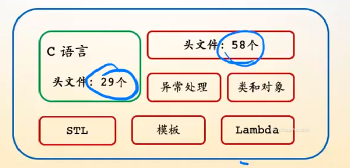
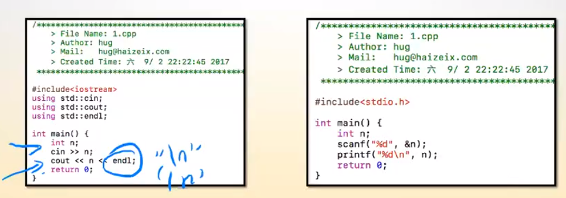
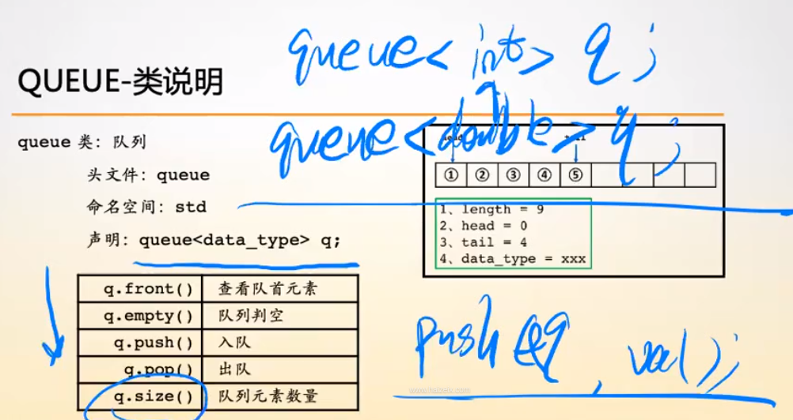
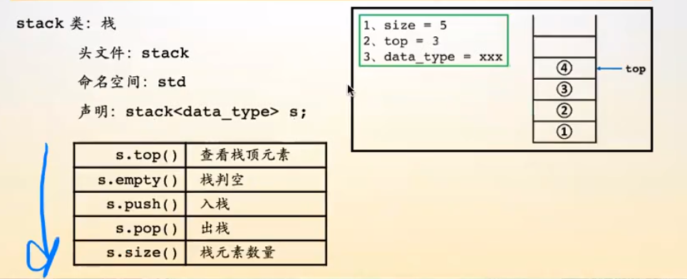
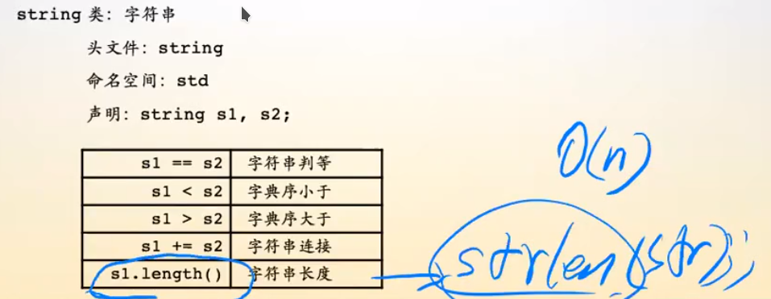
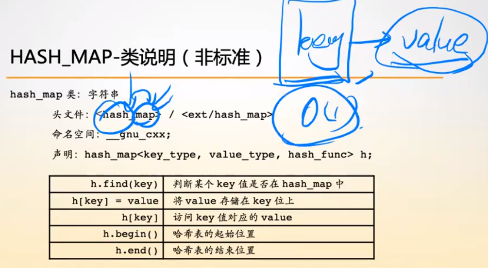
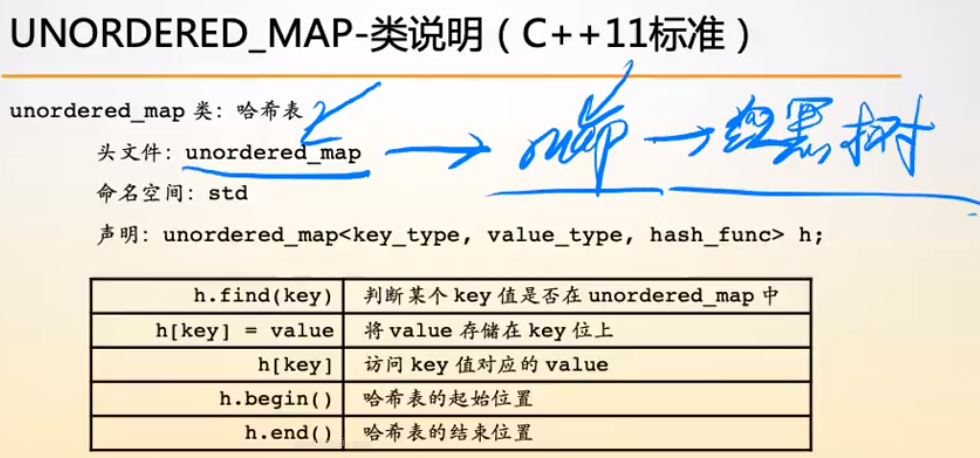
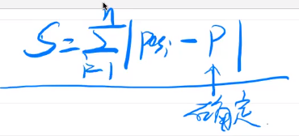
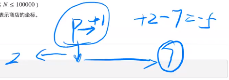
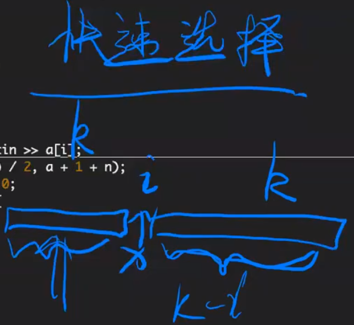

# C++ 程序设计

## 从 C 到 C++

### C++ 语言简介

- C 的超级
  
  - 继承了 C 所有的东西
  - 支持四种编程范式
    - 面向过程
    - 面向对象
    - 泛型编程
    - 函数式编程
  - 数据结构 STL
- C++ 学习方法
  - 因为支持的编程范式多，所有语法特性特别多
  - 学习语言要按编程范式来学习
- C++ 中的 STL (standert template liberary)
  - 程序对比
    
    - <<, >>
    - endl 是一个对象（高级的变量）
    - 输出不用标记类型，C++ 会自动识别类型
  - QUEUE - 类说明
    
    - 在 C 中，实现队列时，要确定每个元素的 byte 数，所有每个队列都要特殊标记，每个队列实现后只能对应一个类型
    - C++ 中，queue 被一被传入任意类型
    - C 面向过程的调用方法 push(q, val)
    - C++ 面成对象 q.push(val)
      - q 是一个对象，存储了值和方法（行为）
  - STACK - 类说明
    
  - STRING - 类说明
    
    - strlen(str) 遍历 O(n)
    - s1.length() 直接读取记录的值 O(1)
  - HASH_MAP - 类说明（非标准）
    
    - 能实现映射的数据类型哟很多，比如 hash map, 红黑二叉排序树
  - UNORDERD_MAP - 类说明 (C++ 标准)
    
    - 容器：抽象化很高的数据结构，标准模板
    - map: 有序键值对 <key, value>
      - 底层实现：红黑树
    - set (集合): 只储存值 <value>
      - 底层实现：红黑树

### 排序方法的使用

- HZOJ 245 货仓选址

  在一条数轴上有 N 家商店，他们的坐标分别为 A[1]−A[N][1]−[N]。现在需要在数轴上建立一家货仓，每天清晨，从货仓到每家商店都要运送一车商品。为了提高效率，求把货仓建在何处，可以使得货仓到每家商店的距离之和最小，输出最短距离之和。

  

  - 目的：确定 P 到底是多少，能让 S 最小

  

  - 如果中转站左边有 2 个货仓，右边有 7 个，那么想做挪动一步，就有 2 个或长 + 1 步，7 个 - 1 步
  - 因此 P 的位置应该是 Pos 序列的中位数
  - 245.cpp
    - nth_element
      

### 字符串类的相关使用

- https://en.cppreference.com/w/cpp/string/basic_string
- HZOJ 166 字符串操作 1

从键盘输入任意的一个字符串 A，其长度 L 不小于 6，同时再输入一个整数 N (其中：N<L)作为插入点，以及任意的一个字符串 B，其长度为 L1 (其中：L1<L1)，现要求完成下列功能：

1. 如果字符串 A 的长度 L 大于 100 输出 100，否则输出 L；
2. 在 N 点处，插入字符串 B 后，将得到一个新字符串 C，请计算并输出最后的字符串；
3. 查找字符串 C 中，从右到左第一个出现字母 x 的位置。

### map 与 set 相关使用

- map.cpp
- map 的底层就是红黑树
- set 也是

### 实现一个储存任意类型的数组

- array.cpp
- 只是幼儿园级别代码，后面还有学习和修改
- 学习要学习的是什么是错误的，后面还要继续学习，这段代码那里还不够完美
